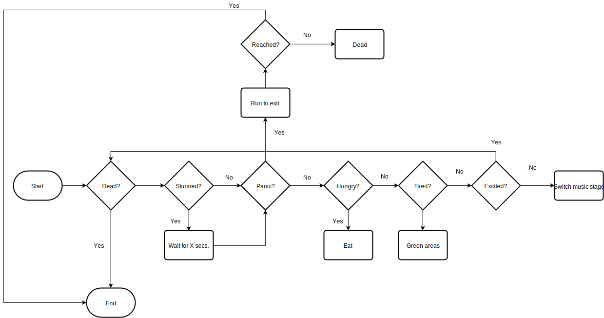

# **Crowd Simulation**
## Who made the project
* __Flávio Santos__ - __a21702344__

* __Leandro Brás__ - __a21801026__

* __Sara Gama__ - __a21705494__

## Contact
* [GitHub](https://github.com/xShadoWalkeR/Crowd-Simulation)

## Who did what
__Flávio Santos__
Implementei as explosões no projeto e todas as suas componentes,
incluindo todos os eventos de uma explosão, a sua propagação, os novos estados
(no nosso, caso Decision Nodes e Action Nodes) pertencentes aos NPCs derivados
das mesmas e a consequente propagação do estado de de pânico entre agentes.

Implement explosions in the project and all it's components, including the
entire events the explosion, it spread, the new states(decision nodes and
action nodes) belonging to NPCs derive from the same and consequent propagation
the state of the panic by the agents.

__Leandro Brás__
Made the original map in unity and put the props, also he build
the base NPC script for resting, eating and going to concerts behaviour using
data trees, and created the spawn system.

__Sara Gama__
Made report, search about AI simulation panic crowd in explosions,
UML and flowchart.

## Introduction
In this project we created a prototype of a festival computer simulation that
uses agents to simulate crowd (watch performances, eat, walk and rest in green
areas) evacuating in the presence of the random explosions that occurs and people
reacts to it (some slower than others); providing multiple tests
disaster scenarios with no cost in lives.
Since this AI project has NPC's we solve this problem with decision tree for
being easy to implement and to understand it. In this way we are planing and
preparing for the suposte disasters, through this we can havea evaluation of
the possible bad scenarios.

Now, a study reveals two distincted reactions when crowd is at panic;
stop-and-go and turbulent flows.[Dirk Helbing, Anders Johansson, and Habib Zein
Al-Abideen Phys. Rev. E 75, 046109 (2007)]
Where stop-and-go flows is supported by a recent model of bottleneck flows in
which proposes a many-particle-inspired theory for granular outflows.
They found that if the inflow is below the maximum outflow they got an asymptotic
stationary solution and if the inflow is above this value, we will observe a queue
formation, which is described as a shock wave equation. They do count with the
lack of space.

While the turbulent flow they had not yet hunderstood well, only that when it
blows there is a sudden displacement, falling and trampling of people. [D. Helbing
et al., Phys. Rev. Lett. 97, 168001 (2006)]

## Metodology
You play in a 2.5D cinematic simulation; for the IA techniques we use decision
trees and navmesh; parameterized values such as the quantity of agents is 100 to 500;
the speedes of everything is 1 to 3.

## Flowchart

## Results & discussion
The project came together as a well made success in terms of representing what
people's reactions could've been in a real festival, apart from the method of
spawning agents which could sometimes sporadically make them fly towards the
sky, since from time to time they would spawn inside others in case the previous
ones were to die at the moment they first spawned.

Apart from the previously explained behaviour, there were no other strange
behaviours made be the AI. To simply put it, an upwards force is added at the
moment of an agent's death if it stands in the kill radius and an outwards force
is applied if it is panicking or stunned. On the moment of an agent's death, if
it happens to spawn inside another while the fire is covering the spawns, this
agent will die instantly, making his rigidbody active and triggering a physics
collision between them, making him ascend to the skyes.
Other than that, the panic spread really feels real and it's pretty entertaining
to watch.

## Conclusion
In this prototype we show a study in a computer simulation that alows us to
notice where and when this accidents tend to occur in festivals and how frequente
they may happen; for this matter this tests are importante to improve and help
understand and organized better big events for people being able to enjoy it
with safety.
So, basically this is a good way to prevent explosions or any other problems
that may hurt or kill people.

## References
* Powerpoints provided by the teacher
* [Unity3D](https://docs.unity3d.com/Manual/index.html)
* [D. Helbing et al., Phys. Rev. Lett. 97, 168001 (2006)](https://journals.aps.org/prl/abstract/10.1103/PhysRevLett.97.168001)
* [Wagner & Agrawal, 2014](https://www.sciencedirect.com/science/article/pii/S0957417413008270)
* [Helbing, Johansson & Al-Abideen, 2007, 4](https://journals.aps.org/pre/abstract/10.1103/PhysRevE.75.046109)
* [Fachada, Lopes, Martins & Rosa, 2015](https://peerj.com/articles/cs-36/?utm_source=TrendMD&utm_campaign=PeerJ_TrendMD_0&utm_medium=TrendMD)
